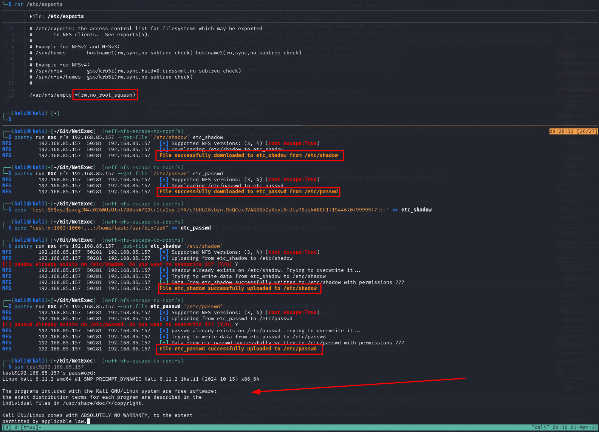

# 🆕 Escape to root file system

By default, NFS exports do not restrict access to files outside the exported directory. To access these files NFS needs the respective file handle. However, the root file handle `/` has a static value, which is file system dependend. Therefore, if one of the shares do not restrict access to the export directory by setting the `"subtree_check"` flag in their config, it is possible to query to root file system and from there every single file on the system.&#x20;

NetExec automatically checks for this "escape to root" on connection, as can be seen by the flag:

```
NFS         <ip>  <port>  <ip>   [*] Supported NFS versions: (3, 4) (root escape:False)
```

This can be leveraged to access all files on the system which are not `root:root` owned, meaning all some non-root identity has read access to the file. A prominent example is the `/etc/shadow` file, which is owned by `root:shadow`. Furthermore, if the options "no\_root\_squash" is set, also root:root files can be read. In combination with the `"rw"` flag, anyone can also upload and overwrite any files on the system and therefore just add themselves as a user.

**Recommendation:** The file `/etc/exports` defines all exported directories with their config and is world readable. If you find a host where the root escape is possible, first download the file and check which options are available to you.

### Leveraging the root escape

NetExec will automatically try to use the root escape if no share was specified in the command.&#x20;

Example for  `--ls`:

```
NetExec nfs <ip> --ls '/'

# Example Output
NFS         <ip>  <port>  <ip>   [*] Supported NFS versions: (3, 4) (root escape:True)
NFS         <ip>  <port>  <ip>   [+] Successful escape on share: /var/nfs/general
NFS         <ip>  <port>  <ip>   UID        Perms  File Size     File Path
NFS         <ip>  <port>  <ip>   ---        -----  ---------     ---------
NFS         <ip>  <port>  <ip>   0          dr--   4.0KB         /.
NFS         <ip>  <port>  <ip>   0          dr--   4.0KB         /..
NFS         <ip>  <port>  <ip>   0          -rwx   7.0B          /bin
NFS         <ip>  <port>  <ip>   0          dr--   4.0KB         /boot
NFS         <ip>  <port>  <ip>   0          dr--   4.0KB         /dev
NFS         <ip>  <port>  <ip>   0          dr--   12.0KB        /etc
...
```

### Owning the system: Demo

As mentioned above, when the options `(rw,no_root_squash)` are set, you can simply download the files `/etc/shadow` and `/etc/passwd`, add yourself and reupload them:

<figure><figcaption><p>Owning a system with NFS</p></figcaption></figure>

### Additional sources:




