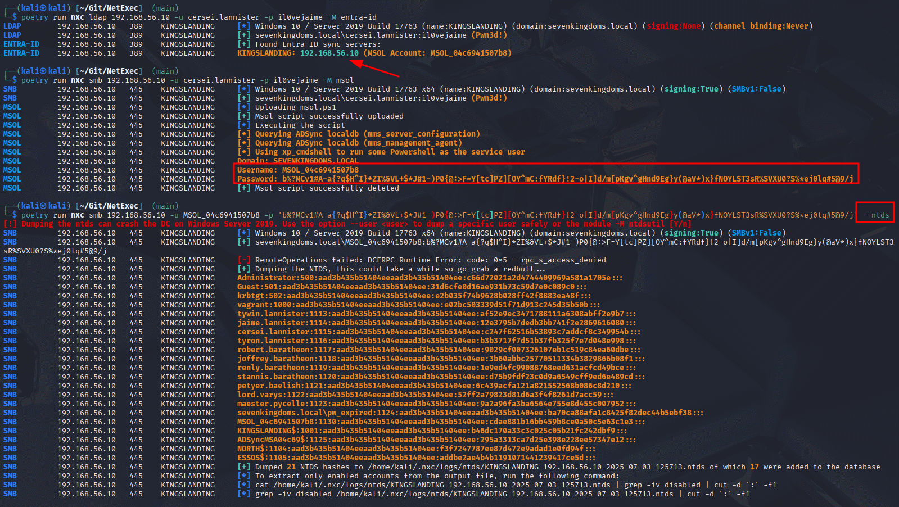

# Enumerate Entra ID

If Entra ID is deployed in Active Directory with cloud sync active, the MSOL account is a high value target, due to its default configuration of having DCSync privileges. This MSOL account can be extracted from a local database on the sync server. To find the Entra ID sync server you can use the NetExec module \`entra-id\`:

```bash
nxc ldap <ip> -u user -p pass -M entra-id
```

<figure><figcaption><p>Hunt for the Entra ID sync server, dump the MSOL account and dump the NTDS.dit</p></figcaption></figure>
