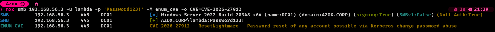
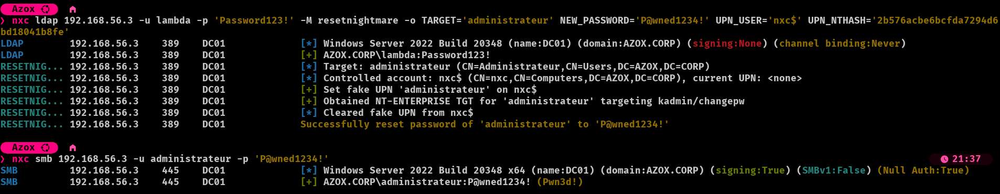

---

## description: Reset any account's password by abusing Kerberos Change Password (CVE-2026-27912)

# 🆕 ResetNightmare

The LDAP `resetnightmare` module exploits **ResetNightmare (CVE-2026-27912)** to reset the password of **any** account (user or computer, including privileged ones like `Administrator` or a Domain Controller) by abusing the **Kerberos Change Password** protocol on an **unpatched DC**.

Unlike a normal password reset, it does **not** require any explicit reset right (`User-Force-Change-Password`, `GenericAll`, …) over the target. It only requires **write access to the** `userPrincipalName` **(UPN)** of a *separate* account you already control.

Based on the ResetNightmare PoC and [Semperis' research](https://www.semperis.com/blog/identity-crisis-novel-vulnerabilities-leading-to-kerberos-downgrade-dos-and-full-domain-takeover/).

---


## What it does

1. Temporarily writes a **fake UPN** on the controlled account (`UPN_USER`), setting it to the `sAMAccountName` **of the target**.
2. Authenticates as `UPN_USER` and requests an **NT-ENTERPRISE TGT** for that UPN, scoped to the change-password service (`kadmin/changepw`). Because the KDC resolves an `NT-ENTERPRISE` principal by its UPN, and the controlled account now carries the target's name, the ticket comes back in the **target's** security context.
3. **Restores** the controlled account's original UPN (or clears it if it had none).
4. Uses the Kerberos **Change Password** protocol with that TGT to set `NEW_PASSWORD` on the target.

---


## Why a separate `UPN_USER`?

This is the part that trips people up, so it's worth spelling out.

The attack works by **overwriting the** `userPrincipalName` of an account you control with the target's name, just long enough to request the ticket. That means `UPN_USER`:

- **must be an account you can write** `userPrincipalName` **to**, i.e. you have `GenericWrite` (or `GenericAll` / `WriteProperty` on the UPN) over it. A machine account you created via the Machine Account Quota, or any account you own, works well.
- **must not be your login account.** During the attack its UPN is set to the target's name. If you reused your authenticating identity, you'd be rewriting the very principal you log in with, which is both messier and more fragile.
- **can be a user or a computer account** (append `$` for a computer, e.g. `UPN_USER=nxc$`).


### What happens to `UPN_USER`?

Only its `userPrincipalName` **attribute** is touched, and only **transiently**:

- Its **password is never changed**, you keep controlling it exactly as before.
- Its original UPN is **restored** at the end of the run. If it had no UPN to begin with (common for computer accounts), the fake one is simply **cleared**.
- The restore runs even if the ticket request fails, so the account is not left with a dangling UPN.

The account whose password actually gets reset is `TARGET`, not `UPN_USER`.

---


## Requirements

- An **unpatched DC** (vulnerable to CVE-2026-27912).
- A controlled account (`UPN_USER`) whose `userPrincipalName` **you can write**, and whose **password or NT hash you know**.
- The **cleartext password** (`UPN_PASSWORD`) **or** the **NT hash** (`UPN_NTHASH`) of `UPN_USER`.

> ⚠️ This is a **destructive** operation: it overwrites the target's password with no way to restore the old one. On a real engagement, reset an account you're allowed to reset, and be ready to hand the new password back to the owner.

---


## Checking if the DC is vulnerable

Before firing the exploit, you can confirm the DC is vulnerable to CVE-2026-27912 with the `enum_cve` module over SMB:

```bash
nxc smb <ip> -u <user> -p <pass> -M enum_cve -o CVE=CVE-2026-27912
```



enum_cve flagging the DC as vulnerable to CVE-2026-27912 (ResetNightmare)

---


## Module Options


| Option         | Description                                                                                             | Required                           |
| -------------- | ------------------------------------------------------------------------------------------------------- | ---------------------------------- |
| `TARGET`       | `sAMAccountName` of the account whose password gets reset (append `$` for a computer)                   | yes                                |
| `NEW_PASSWORD` | New password to set on `TARGET`                                                                         | yes                                |
| `UPN_USER`     | `sAMAccountName` of a controlled account you can write a `userPrincipalName` to (not the login account) | yes                                |
| `UPN_PASSWORD` | Cleartext password of `UPN_USER`                                                                        | one of `UPN_PASSWORD`/`UPN_NTHASH` |
| `UPN_NTHASH`   | NT hash of `UPN_USER`                                                                                   | one of `UPN_PASSWORD`/`UPN_NTHASH` |


---


## Usage Examples

Reset a user's password with a controlled account's cleartext password:

```bash
nxc ldap <ip> -u <user> -p <pass> -M resetnightmare -o TARGET=Administrator NEW_PASSWORD='NewPass!' UPN_USER=controlled UPN_PASSWORD='Passw0rd!'
```

Using the controlled account's NT hash instead of its password:

```bash
nxc ldap <ip> -u <user> -p <pass> -M resetnightmare -o TARGET=Administrator NEW_PASSWORD='NewPass!' UPN_USER=controlled UPN_NTHASH='31d6cfe0d16ae931b73c59d7e0c089c0'
```

Reset a computer account, using another machine account you control:

```bash
nxc ldap <ip> -u <user> -p <pass> -M resetnightmare -o TARGET=DC01$ NEW_PASSWORD='NewPass!' UPN_USER=controlled$ UPN_PASSWORD='Passw0rd!'
```


### Example Output



Resetting the domain administrator's password, then logging in over SMB with the new one

The new password is also stored in the NetExec database, so you can retrieve it later even if you miss it scrolling by.

---


## References

