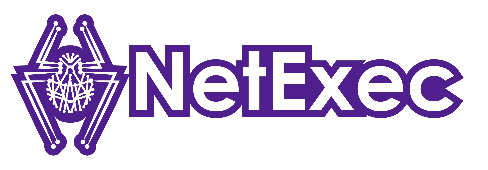

# Logo & Banner

NetExec's amazing icon, logo, and banner were created by [Stephanie Seger](https://www.stephanieseger.com/).

They are below for inclusion wherever it is needed!

<figure><figcaption>
NetExec Banner
</figcaption></figure>

<figure><figcaption>
NetExec Logo All Purple
</figcaption></figure>

<figure><figcaption>
NetExec Logo Purple Outline
</figcaption></figure>

<figure><figcaption>
NetExec Logo All White
</figcaption></figure>

<figure><figcaption>
NetExec Spider
</figcaption></figure>

<figure><figcaption>
NetExec Purple
</figcaption></figure>

<figure><figcaption>
NetExec White
</figcaption></figure>
