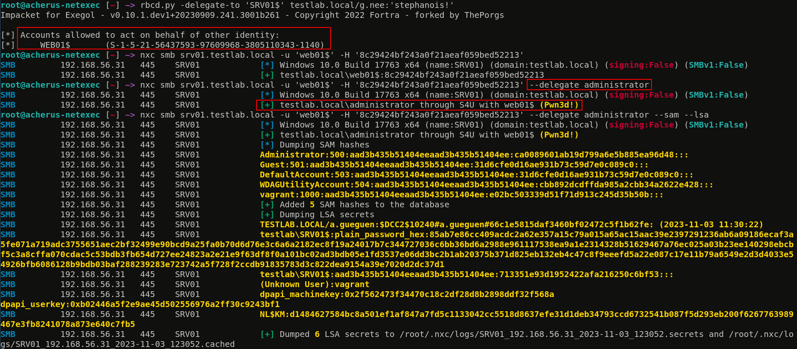
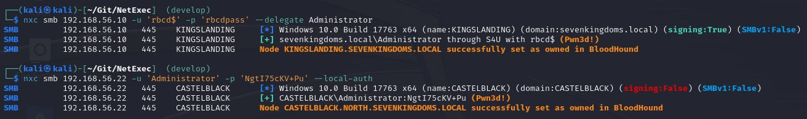
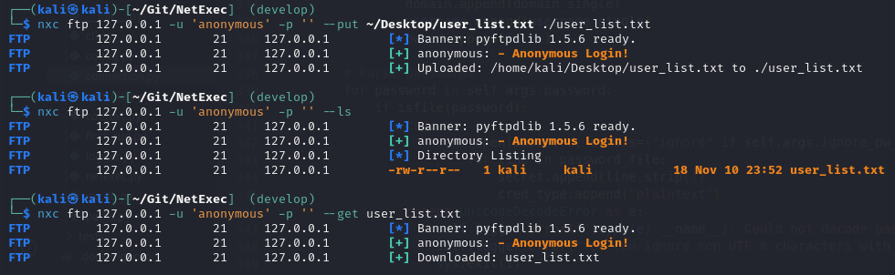
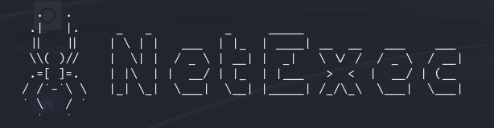

# 🔧 v1.1.0 - nxc4u



A new release of NetExec has been released!

In this blog post we will give an overview of what is new in the current release and what we have been working on over the last few weeks. Native binaries for Linux, Windows and MacOS are available on GitHub. The latter has not been tested though, so please report any problems you encounter with any of these binaries.

Over the past month we have had a huge amount of pull requests and issues opened and resolved. We really want to thank you all for the great participation in NetExec. Not only pull requests, but also people filing issues are really valuable. Pointing out what bugs still exist and what features could make nxc even better is really important!

<figure><figcaption></figcaption></figure>

There were a lot of really cool PRs so lets dive in:

### Ever heard of Kerberos Delegation?

A new core feature has been added that automates the Kerberos extensions S4U2Self and S4U2Proxy by [@zblurx](https://twitter.com/_zblurx). It allows you to abuse Kerberos Constrained Delegation with protocol transition and Resource-based Constrained Delegation automatically in NetExec.

<figure><figcaption></figcaption></figure>

It is also possible to use only S4U2Self in order to impersonate any account on a domain joined computer for which you know the credentials:

<figure><figcaption></figcaption></figure>

### Execute Tasks on behalf of logged-on Users with Scheduled Tasks

Hunt for users logged on to systems where they shouldn't be 🏹 Executing commands with user sessions is now easier than ever, thanks to the new "schtask\_as" module by [@Defte\_](https://twitter.com/Defte_). This allows you to impersonate logged-on users using the Windows task scheduling mechanism.

<figure><figcaption></figcaption></figure>

### Refactoring and bug fixes

A huge refactoring has been done behind the scenes, mainly by [@MJHallenbeck](https://twitter.com/MJHallenbeck). A number of bugs have been fixed, log messages have been added, and the overall code quality has been greatly improved. The CLI will now check for linting to ensure good code quality in the future :rocket:

A number of other bugs has been fixed, check out the GitHub release page for those!

### BloodHound now supports computer accounts

The BloodHound extension now also marks computer accounts as owned if you compromise the corresponding host, thanks to [@NeffIsBack](https://twitter.com/al3x_n3ff). This comes in handy if you gain local admin privileges through lateral movement or delegation.

<figure><figcaption></figcaption></figure>

### FTP Enhancement

Many great improvements have been contributed by [@RomanRII](https://twitter.com/riiroman). The FTP protocol can now list files in any directory. Also, you can now download and upload files with FTP using the `--get` and `--put` command respectively!

<figure><figcaption></figcaption></figure>

### Module sorting

Previously, it was difficult to see which modules you could use if you were not already a local or domain administrator. Now modules are sorted by the privileges required for execution so you can get a better idea of which modules are available for further privilege escalation and lateral movement.

<figure><figcaption></figcaption></figure>

### WinRM improvements

The stability of the WinRM protocol has been greatly improved by [@Xiaoli](https://twitter.com/Memory_before). It is now more light-weight, has better exception handling and better command execution.

### ASCII-Art

We now have a cool spider in our CLI, crawling through the network... :spider::sunglasses:\
Made by [@bongobongostan](https://twitter.com/bongobongostan).

<figure><figcaption></figcaption></figure>

### The GitBook wiki is now open source!

At the time of publishing this GitBook will be synced to GitHub. This means anybody can contribute to this GitBook via a Pull Request on GitHub! There is a lot left to do, for example we desperately need a contributors guide, but none of the dev team had time for it.\
You will find the repository of the wiki here: [https://github.com/Pennyw0rth/NetExec-Wiki](https://github.com/Pennyw0rth/NetExec-Wiki)

_Notes by_ \[[Alex](https://app.gitbook.com/u/alCUfo8lzveMZiazRt7RlLHEgiO2 "mention")]\(https://x.com/al3x\_n3ff)
