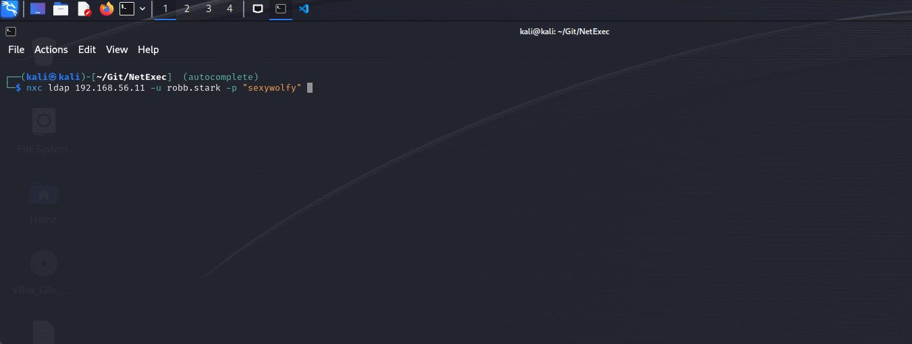

# 📡 v1.2.0 - ItsAlwaysDNS

Hello everyone!

It has been quite a while since the last release. We now have so many great features that a new release was long overdue. But first of all, a big thank you to all the contributors and people who have contributed ideas, submitted issues and participated on the [Discord server](https://discord.gg/pjwUTQzg8R). So let us dive into the long list of amazing new modules and features and start with our first big announcement.

<figure><figcaption>
Woop woop
</figcaption></figure>

## NetExec is available on Kali:rocket:

The biggest news first, thanks to the great help of [@arszilla ](https://x.com/arszilla)this release is also available on kali. After about 3 months of package updates on the Kali side everything is ready for the launch. So now you can just install the latest release with apt:

<figure><figcaption>
Installing NetExec with apt
</figcaption></figure>

## It's Always DNS ...

... and that's why we now have fully integrated DNS options, thanks to [@XiaoliChan](https://x.com/Memory_before)! You can specify a DNS server with `--dns-server` or force TCP to be used for DNS with `--dns-tcp`. This also allows you to force IPv6 with `-6` and set a DNS timeout with `--dns-timeout`.

## It's Credential Looting Time💰

Ever heard of SCCM? You can now dump all SCCM credentials stored by the DPAPI with the new flag `--sccm`. Also there are a ton of new modules that loot various software which can store credentials like MobaXterm, mRemoteNG, some vnc server software and Google Refresh Tokens, thanks to [@zblurx](https://x.com/_zblurx)!&#x20;

<figure><figcaption>
Looting SCCM
</figcaption></figure>

<figure><figcaption>
Looting MobaXterm
</figcaption></figure>

<figure><figcaption>
Looting mRemoteNG
</figcaption></figure>

<figure><figcaption>
Looting VNC
</figcaption></figure>

## Looting PuTTY

Also credentials and RSA private keys stored in PuTTY can be looted thanks to an addition by [@NeffIsBack](https://x.com/al3x_n3ff).

<figure><figcaption>
Looting RSA private keys and proxy credentials stored by PuTTY
</figcaption></figure>

## Extract obsolete operating systems from LDAP

With the new LDAP module `-M obsolete` you can query for obsolete operating systems in LDAP! Made by [@Shad0wC0ntr0ller](https://x.com/Shad0wCntr0ller).

## New LDAP flag for retrieving active Users on the Domain

The new LDAP Flag `--active-users` serves the same purpose as `--users`, but filters out deactivated accounts. Made by [@termanix](https://github.com/termanix).

## New SMB Module Printerbug

The well-known coercion technique using Printerbug can now be exploited with NetExec, abusing MS-RPRN! Made by [@lodos2005](https://github.com/lodos2005).



## Hunt for the ADCS using SMB

A new SMB module is now available, that enumerates DCERPC endpoints for certsrv.exe, indicating that the server is a CA. It also enumerates whether the CA is vulnerable against ESC8. Made by [@0xjbb](https://github.com/0xjbb).

## New LDAP Module Enumerate userPassword and unixUserPassword Attribute

There is software that will populate the LDAP attributes `userPassword` and `unixUserPassword` potentially with credentials in plaintext. The new LDAP modules `-M get-userPasswsord` and `-M get-unixUserPassword` will query all users for these attributes. Made by [@Syzik](https://x.com/SyzikSecu).

## New Winlogon Autologon Module

Windows allows to configure user that will automatically log on to a machine on startup. With the new SMB module by [@swisskyrepo](https://x.com/pentest_swissky) you can now retrieve the content of the keys **DefaultDomainName, DefaultPassword, DefaultUserName, AutoAdminLogon** stored in the registry `HKLM\Software\Microsoft\Windows NT\CurrentVersion\Winlogon`, which are used for that logon process.



## Raw LDAP queries

There is now a new LDAP flag `--query "(Object)" "Filter"` with the standard ldapsearch syntax to be able to quickly look up attributes in LDAP. Made by [@NeffIsBack](https://x.com/al3x_n3ff).

## Updated LDAP and SMB User enumeration

SMB/LDAP `--users` and LDAP `--active-users` flags now allow filtering for specific users! Thanks to [@Marshall-Hallenbeck](https://x.com/MJHallenbeck).

 

## Updated PSO Module

[@sebrink](https://x.com/_sandw1ch) updated the pso module which retrieves all fine-grained password policies in the domain, giving the module a fresh new look and fixing a critical bug, where a policy wasn't displayed if it was attached to multiple obejcts.

## Authentication throttling

The old `--jitter` option got reworked to enable throttling of authentications. Super useful if you want to be a bit more stealthy or bypass lock out mechanisms. Made by [@NeffIsBack](https://x.com/al3x_n3ff).

## Tab-completion

Thanks to [@Adamkadaban](https://x.com/Adamkadaban) NetExec now supports tab-completion if installed with pipx! Check out the Installation page for the setup.

<figure><figcaption>
Tab-completion with NetExec
</figcaption></figure>

## Rework of the Powershell command execution

A major overhaul of the powershell functionality within NetExec has taken place, fixing most bugs and improving overall usability and stability. Obfuscation and Amsi bypasses have also been set to non-default, as they were often flagged even by AVs. A nice side effect is that the `ps32` downgrade now bypasses Windows Defender😄\
Made by [@Marshall-Hallenbeck](https://x.com/MJHallenbeck).

<figure><figcaption>
Bypassing Windows Defender with --force-ps32
</figcaption></figure>

## Outro

If you want to read about all changes in detail or download the latest standalone binaries check out the github page:



_Notes by_ [[Alex](https://app.gitbook.com/u/alCUfo8lzveMZiazRt7RlLHEgiO2 "mention")](https://x.com/al3x_n3ff)
