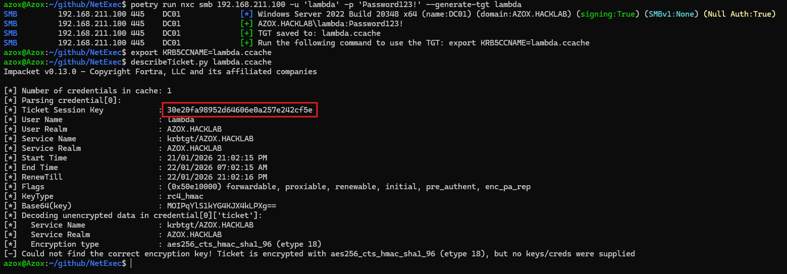
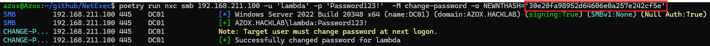
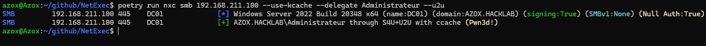
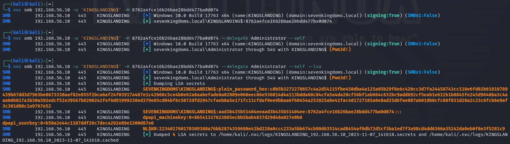

# 🆕 Delegation

## RBCD

If you have an object with the `msDS-AllowedToActOnBehalfOfOtherIdentity` attribute set to an account you control you can use the impersonate flag inside NetExec to automatically execute the Resource Based Constrained Delegation and impersonate any user:

```bash
nxc smb 192.168.56.11 -u jon.snow -p iknownothing --delegate Administrator
```

<figure><figcaption><p>RBCD with NetExec</p></figcaption></figure>
 
### RBCD without an SPN (`--u2u`)

RBCD (like traditional constrained delegation) is driven by Microsoft’s Services for User (S4U) extensions, not by the core Kerberos exchange alone. S4U2Self is a TGS-REQ where `sname` specifies your own principal, `PA-FOR-USER` specifies the user to impersonate, and the KDC returns a service ticket for yourself encrypted with your account’s long-term key, carrying that user’s PAC. S4U2Proxy is a second TGS-REQ for the real target SPN (e.g. `cifs/host`): you put the S4U2Self ticket in `additional-tickets` as evidence so the KDC can issue a normal service ticket whose PAC matches the evidence ticket instead of your TGT’s PAC.

On S4U2Self, the KDC must choose which key encrypts that first ticket. It does so from `sname` / the service principal identity. If your account has no SPN, that lookup fails and you often get `KDC_ERR_S_PRINCIPAL_UNKNOWN`.

User-to-user (U2U) behaviour is defined in RFC 4120 (e.g. `enc-tkt-in-skey` in KDC-OPTIONS and a ticket in `additional-tickets`): the KDC encrypts the issued ticket with the session key of the ticket you supplied in `additional-tickets`, instead of the target service’s long-term key. In textbook U2U that ticket is often the target service’s TGT, for SPN-less RBCD you instead supply your own TGT during S4U2Self so the “self” ticket is encrypted with your TGT session key, avoiding the broken SPN-based key resolution.

S4U2Proxy still expects to decrypt the evidence ticket using your account’s long-term key (NT hash). That decryption fails if the evidence ticket was U2U-encrypted with your TGT session key. The fix is to set your NT hash equal to that RC4 session key before the proxy step (e.g. Samr/SAM password APIs, NetExec’s `change-password` module with `NEWNTHASH`, etc.). This requires RC4 still being viable, prior knowledge of password or NT hash to authorize the change, and it breaks normal password logon until the hash is reset.

NetExec wires this with `--u2u` alongside `--delegate` (S4U2Self+U2U then S4U2Proxy), as described by James Forshaw in [Exploiting RBCD using a normal user account](https://www.tiraniddo.dev/2022/05/exploiting-rbcd-using-normal-user.html).

**Typical workflow**

1. Obtain a TGT for the user without an SPN (e.g. `--generate-tgt <basename>` against the DC), then read the session key from the ccache file (e.g. Impacket’s `describeTicket.py`).

```bash
nxc smb 192.168.56.11 -u jon.snow -p iknownothing --generate-tgt jon.snow
export KRB5CCNAME=jon.snow.ccache
describeTicket.py jon.snow.ccache
```

> **Note:** The KDC may pick an AES session key, the next step needs RC4-HMAC. If the ticket is not RC4, request the TGT with NT hash authentication (`-H`) instead of a password, then re-check with `describeTicket`.

<figure><figcaption><p>TGT creation and reading the RC4 session key</p></figcaption></figure>

2. Set the account’s NT hash to the hex value of the TGT’s RC4 session key (the same value shown for the ticket).

```bash
nxc smb 192.168.56.11 -u jon.snow -p iknownothing -M change-password -o NEWNTHASH='<rc4_session_key>'
```

<figure><figcaption><p>Setting the NT hash to the session key via the <code>change-password</code> module</p></figcaption></figure>

3. Run the RBCD chain with `--delegate` and `--u2u`, using the TGT ccache via `--use-kcache` with `KRB5CCNAME` pointing at the ccache file.

```bash
export KRB5CCNAME=jon.snow.ccache
nxc smb 192.168.56.11 --use-kcache --delegate Administrator --u2u
```

<figure><figcaption><p>Successful RBCD via S4U+U2U with <code>--u2u</code></p></figcaption></figure>

## S4U2Self

If you have a computer account you can (nearly) always get local administrator with the s4u2self extension:

```bash
nxc smb 192.168.56.10 -u 'KINGSLANDING$' -H 220fc1990391bdc183d1a68c389c0229 --delegate Administrator --self
```

<figure><figcaption><p>S4U2Self abuse using NetExecs delegation feature</p></figcaption></figure>

## Resources:








