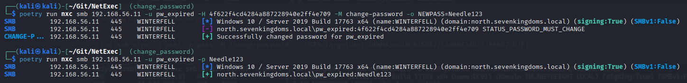
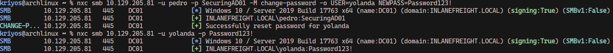
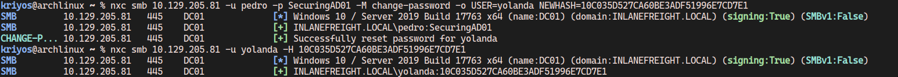

# Change User Password

If you encounter an account with a correct password but either `STATUS_PASSWORD_MUST_CHANGE` or `STATUS_PASSWORD_EXPIRED`, you usually won't be able to use it.\
However, with the `change-password` module, you can change the password of a target user.

You can also abuse `ForceChangePassword` to change the password of a user with this module.

### Change Password of the Current User

Change the password of the current user to NewPassword or a new NT hash:

```bash
nxc smb <ip> -u user -p pass -M change-password -o NEWPASS=NewPassword
nxc smb <ip> -u user -p pass -M change-password -o NEWNTHASH=31d6cfe0d16ae931b73c59d7e0c089c0
```

<figure><figcaption><p>Reset Password of current the user</p></figcaption></figure>

### Change Password of a different User

Change the password of different user with `ForceChangePassword` or admin privileges to NewPassword or a new NT hash:

```bash
nxc smb <ip> -u user -p pass -M change-password -o USER=TargetUser NEWPASS=NewPassword
```



Change the NT hash of TargetUser to 10C035D527CA60BE3ADF51996E7CD7E1

```bash
nxc smb <ip> -u user -p pass -M change-password -o USER=TargetUser NEWHASH=10C035D527CA60BE3ADF51996E7CD7E1
```



Made by [@FaganAfandiyev](https://x.com/kriyosthearcane), [@termanix](https://github.com/termanix) and [@NeffIsBack](https://x.com/al3x_n3ff).
