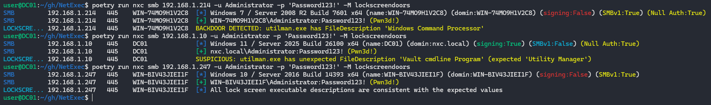

# 🆕 Enumerate changed lockscreen executables



Attackers can replace accessibility executables in Windows (e.g. `utilman.exe`, `sethc.exe`) with binaries like `cmd.exe` or `powershell.exe` to spawn a SYSTEM-level shell. These backdoors can be triggered from the lock screen without authentication.

This module checks for tampered lock screen executables by comparing their FileDescription metadata against expected values:

```bash
nxc smb 10.10.10.10 -u 'Administrator' -p 'PASSWORD' -M lockscreendoors
```

The module connects to `C$\Windows\System32` and checks the following executables:

* `utilman.exe`
* `narrator.exe`
* `sethc.exe`
* `osk.exe`
* `magnify.exe`
* `EaseOfAccessDialog.exe`
* `voiceaccess.exe`
* `displayswitch.exe`
* `atbroker.exe`

If the FileDescription field of one of these executables does not match its expected value, it is flagged as suspicious. If the description matches known backdoor patterns (`Windows PowerShell` or `Windows Command Processor`), it is marked as a backdoor.

If Network Level Authentication (NLA) is not enabled, an attacker can start an unauthenticated RDP session and interact with the lock screen. In combination with a tampered accessibility executable, this allows an unauthenticated attacker to spawn a SYSTEM shell on the target host.

## Example Output

The following screenshot shows all three possibilities:

* A system with default executables (clean),
* A suspicious system with unexpected descriptions,
* A system with known backdoored files.

<figure><figcaption><p>Known backdoored executables, suspicious descriptions and a clean system</p></figcaption></figure>


This method is not bulletproof, an attacker can easily modify the FileDescription metadata resulting in false negatives

