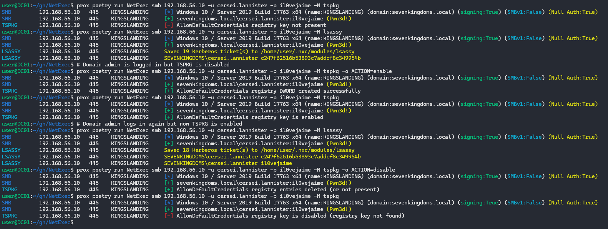

# 🆕 TSPKG - enable cleartext passwords from LSASS with TSPKG / CredSSP


You need at least local admin privilege on the remote target, use option **--local-auth** if your user is a local account


This module inspects, enables, or disables the `AllowDefaultCredentials` policy used by TSPKG / CredSSP credential delegation. Enabling these registry entries allow cleartext passwords in LSASS.

```bash
# Check (default)
nxc smb 10.10.10.10 -u 'Administrator' -p 'PASSWORD' -M tspkg

# Enable credential delegation
nxc smb 10.10.10.10 -u 'Administrator' -p 'PASSWORD' -M tspkg -o ACTION=enable

# Disable credential delegation
nxc smb 10.10.10.10 -u 'Administrator' -p 'PASSWORD' -M tspkg -o ACTION=disable

# Example: run lsassy module to demonstrate the effect
nxc smb 10.10.10.10 -u 'Administrator' -p 'PASSWORD' -M lsassy
```

## What the module does

* check (default) - Reads `HKLM\SOFTWARE\Policies\Microsoft\Windows\CredentialsDelegation` and reports whether `AllowDefaultCredentials` is present.
* enable - Creates the policy key if missing, sets the `AllowDefaultCredentials` `REG_DWORD` to `1`, sets `ConcatenateDefaults_AllowDefault` to `1`, and adds an `AllowDefaultCredentials` subkey with value `1 = "*"` (wildcard SPN). This config mimics how credential delegation is enabled and allow extraction tools to recover cleartext creds.
* disable - Attempts to delete the `AllowDefaultCredentials` subkey and the `AllowDefaultCredentials` / `ConcatenateDefaults_AllowDefault` values.

## How it works

1. The module uses Impacket's `RemoteOperations` helper to enable the remote registry RPC and get an HKLM handle.
2. It opens (or creates) `HKLM\\SOFTWARE\\Policies\\Microsoft\\Windows\\CredentialsDelegation`.
3. Depending on the chosen action, it will query, set, or delete the `AllowDefaultCredentials` `REG_DWORD` and the `ConcatenateDefaults_AllowDefault` `REG_DWORD` and the `AllowDefaultCredentials` subkey entries.

## Example screenshot

The screenshot below demonstrates the effect the module has when combined with `lsassy`:

<figure><figcaption><p>Sequence: check (disabled) → lsassy shows only hash → enable TSPKG → DA now logged in with TSPKG enabled → lsassy shows hash + cleartext → disable TSPKG</p></figcaption></figure>