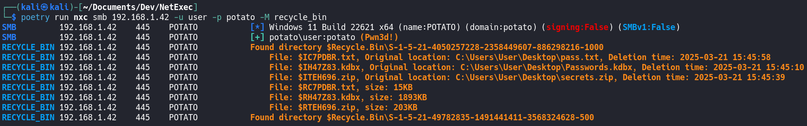
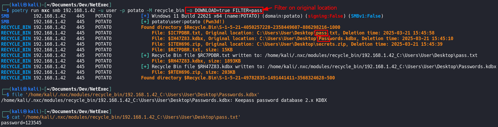

# Recycle Bin Module


This module requires administrator privileges.


This module lists deleted files in the Recycle Bin for every user. It shows the original location/filename of the deleted file as well as the date when it was deleted.

List files in the Recycle Bin on the remote target:

```bash
nxc smb 192.168.1.10 -u USER -p PASSWORD -M recyclebin
```

<figure><figcaption><p>Listing Recycle Bin files</p></figcaption></figure>

List and download all files in the Recycle Bin on the remote target:

```bash
nxc smb 192.168.1.10 -u USER -p PASSWORD -M recyclebin -o DOWNLOAD=true
```

List and download only specific files using a filter on the original name (file name) value:


The below command only downloads files that contain the word "pass" in their original filename.


```bash
nxc smb 192.168.1.10 -u USER -p PASSWORD -M recyclebin -o DOWNLOAD=true FILTER=pass
```

<figure><figcaption><p>Download files with names that contain the word "pass"</p></figcaption></figure>

## Module Options

```bash
DOWNLOAD    Download the files in the Recycle Bin (default: False)
            Example: -o DOWNLOAD=True
FILTER      Filter what files you want to download (default: all) based on their original filename, supports regular expressions
            Example: -o FILTER=pass
```
